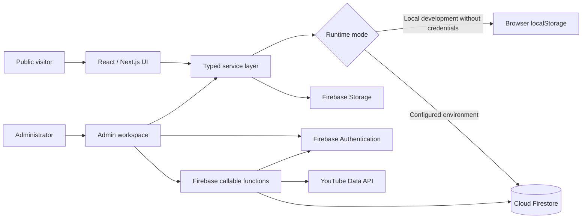
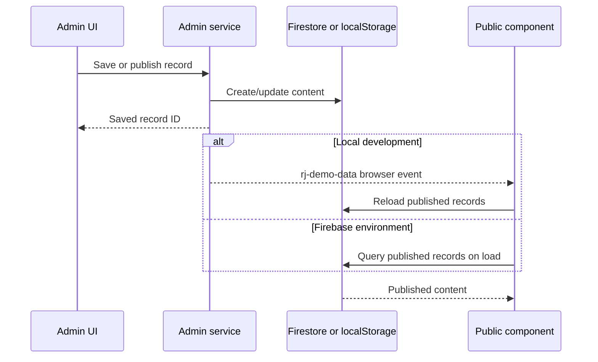

# RJ Tractor Techs — Website Architecture

> Editorial review implementation: see [editorial-review-platform.md](docs/editorial-review-platform.md) for the current review workflow, local D1/R2 storage, Editor permissions and production setup. The older browser-storage and owner-submission descriptions below are historical.

## 1. System overview

RJ Tractor Techs is a content-led tractor research platform with a public website and an integrated administration workspace. The application is built with React 19, Next.js App Router conventions, TypeScript, and Vinext/Vite. Production content, identity, media, and privileged account operations are backed by Firebase.



## 2. Runtime and rendering

- `app/` follows the Next.js App Router model for routes, layouts, metadata, loading states, error handling, sitemap, and robots output.
- Vinext compiles the application through Vite for a Cloudflare-compatible production runtime.
- Interactive pages are client components where filtering, forms, authentication, CRM actions, or live CMS updates are required.
- Dynamic detail routes use URL slugs for tractors, brands, articles, reviews, videos, dealers, equipment, categories, and horsepower collections.
- Global visual design and responsive behavior live in `app/globals.css`.

## 3. Application layers

### Presentation layer

- `app/` contains route entry points and route-specific compositions.
- `components/` contains reusable public UI, forms, cards, SEO helpers, and site chrome.
- `components/admin/` contains the shared admin shell and generic CRUD interface.
- `config/admin-sections.ts` defines the CMS modules and their editable fields.

### Domain and service layer

- `services/tractors.ts` handles tractor and brand queries.
- `services/public-content.ts`, `services/media.ts`, `services/phase-three.ts`, and `services/site-data.ts` expose published website content.
- `services/admin.ts` provides shared CMS list, create, update, delete, count, and image-upload operations.
- `services/leads.ts` owns lead capture, status changes, internal notes, and deletion.
- `services/user-admin.ts` calls privileged account-management functions.
- `services/analytics.ts` records and reads local interaction events.
- `types/content.ts` defines the shared content contracts used by routes and services.

### Infrastructure layer

- `lib/firebase/client.ts` initializes Firebase Authentication, Firestore, Storage, Analytics, and optional App Check.
- `lib/local-demo.ts` provides browser-local persistence when Firebase credentials are intentionally bypassed during local development.
- `functions/src/index.ts` contains callable Firebase Functions for user roles, account disabling, and YouTube synchronization.
- `firestore.rules`, `storage.rules`, and `firestore.indexes.json` define Firebase authorization and query infrastructure.

## 4. Public website

The public experience is organized into these main surfaces:

| Area | Representative routes | Purpose |
| --- | --- | --- |
| Homepage | `/` | Hero, animated brand showcase, CMS modules, popular tractors, editorial content, YouTube and newsletter calls to action |
| Tractor research | `/tractors`, `/tractor/[brand]/[model]`, `/tractors/[hp]` | Search, filtering, specifications, prices, comparisons and enquiries |
| Brands | `/brands`, `/brand/[slug]` | Manufacturer directory and brand profiles |
| Editorial | `/articles`, `/articles/[slug]`, `/reviews`, `/news`, `/category/[slug]` | Guides, news, expert and owner review content |
| Media | `/videos`, `/videos/[slug]` | YouTube-connected video library |
| Marketplace support | `/dealers`, `/equipment`, `/tractor-price`, `/emi-calculator` | Dealer discovery, implements, price research and finance estimates |
| Customer account | `/login`, `/account`, `/account/favourites` | Authentication and saved content |
| Utility | `/search`, `/compare`, `/contact` | Cross-content search, tractor comparison and enquiries |

Published records are the public visibility boundary. Draft CMS records remain in the admin workspace until their status is changed to `published` (or `approved` for supported review flows).

## 5. Administration workspace

All admin modules share `AdminShell`, which provides access checks, the persistent navigation, active-route state, and local-demo messaging. Internal routes use client-side navigation and prefetching to avoid full-page reloads.

The generic route `/admin/[section]` renders `AdminCrud` using the schema in `config/admin-sections.ts`. This keeps common create, edit, publish, image upload, and delete behavior consistent across:

- Tractors and brands
- Owner and expert reviews
- Equipment
- Articles and categories
- Videos
- Dealers
- Banners and advertisements
- SEO and site settings
- Homepage sections
- Contact messages and newsletter subscribers

Specialized modules are used where generic CRUD is insufficient:

- `/admin/leads` provides lead metrics, filtering, status management, internal notes, and confirmed deletion.
- `/admin/users` manages roles and disabled states through secure callable functions.
- `/admin/analytics` summarizes interaction and lead-source activity.

## 6. Data flow

### Admin content to public pages



### Lead lifecycle

1. A visitor submits a `LeadForm` from a tractor, contact, dealer, or finance surface.
2. `services/leads.ts` creates a lead with status `New` and records its source.
3. The Lead CRM lists the latest leads and lets an administrator change status or save internal notes.
4. Confirmed deletion removes the lead from the active data store.

## 7. Local development mode

When `NODE_ENV` is `development` and Firebase credentials are absent, the application enters local demo mode:

- Admin authentication is bypassed for localhost only.
- CMS records, leads, and uploaded images are stored in the browser.
- Image files are represented as data URLs.
- The `rj-demo-data` event refreshes listening public components immediately after admin changes.
- Local data is device- and browser-specific and is not production persistence.

When Firebase environment variables are supplied, the same service interfaces switch to Firebase automatically.

## 8. Authentication and authorization

- Firebase Authentication provides customer and administrator identity.
- `hooks/useAuth.tsx` exposes customer session state.
- `hooks/useAdmin.ts` checks active administrator membership and role.
- Firestore and Storage rules enforce direct data access restrictions.
- High-privilege user operations run in Firebase callable functions, not directly in the browser.
- Only a Super Admin can assign Admin or Super Admin roles.
- An administrator cannot disable their own account.
- Optional Firebase App Check uses reCAPTCHA v3 when a site key is configured.

The localhost credential bypass must never be treated as production authorization.

## 9. Firebase collections

Primary collections include:

`tractors`, `brands`, `leads`, `reviews`, `expertReviews`, `equipment`, `articles`, `articleCategories`, `videos`, `dealers`, `banners`, `advertisements`, `seo`, `settings`, `homepageSections`, `contactMessages`, `newsletterSubscribers`, `users`, and `admins`.

Each content module uses its own collection. Common records include an `id`, content-specific fields, a publication `status`, and timestamps. Images are uploaded under `admin/<collection>/...` in Firebase Storage.

## 10. Deployment architecture

- `pnpm build` runs the Vinext production build.
- `.openai/hosting.json` associates the checkout with its Sites hosting project.
- The generated application targets a Cloudflare-compatible worker runtime.
- Firebase remains the external backend for authentication, Firestore data, media storage, analytics initialization, and callable functions.
- Firebase Functions are deployed separately from the website runtime.

## 11. Repository structure

```text
app/                    Routes, layouts, metadata and global styles
components/             Reusable public components
components/admin/       Shared admin shell and CRUD UI
config/                 Admin module schemas
hooks/                  Authentication and admin-access hooks
lib/                    Firebase setup and local demo adapter
services/               Data access and domain operations
types/                  Shared TypeScript content contracts
functions/              Privileged Firebase callable functions
public/                 Static public assets
firestore.rules         Firestore authorization policy
storage.rules           Storage authorization policy
firestore.indexes.json  Required Firestore indexes
firebase.json           Firebase project configuration
.openai/hosting.json    Sites hosting project association
```

## 12. Architectural principles

- Keep route components focused on presentation and interaction; place persistence logic in services.
- Use the same service contract for local demo and Firebase modes.
- Make publication status the explicit boundary between admin drafts and public content.
- Keep privileged identity operations server-side in callable functions.
- Reuse the schema-driven CRUD module for standard CMS collections and create specialized admin modules only for distinct workflows.
- Preserve responsive behavior, accessible interaction states, and reduced-motion support across public and admin experiences.
